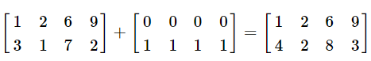
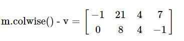

[Eigen: Reductions, visitors and broadcasting](http://eigen.tuxfamily.org/dox/group__TutorialReductionsVisitorsBroadcasting.html)

本文解释Eigen的约简、访客和广播以及它们如何用于矩阵和数组。

# 约简

在Eigen，约简单是把一个矩阵和数组变成一个标量。一个经常用到的约简是`sum()`,它返回所有矩阵和阵列元素的和。

```c++
#include <iostream>
#include <Eigen/Dense>
 
using namespace std;
int main()
{
  Eigen::Matrix2d mat;
  mat << 1, 2,
         3, 4;
  cout << "Here is mat.sum():       " << mat.sum()       << endl;
  cout << "Here is mat.prod():      " << mat.prod()      << endl;
  cout << "Here is mat.mean():      " << mat.mean()      << endl;
  cout << "Here is mat.minCoeff():  " << mat.minCoeff()  << endl;
  cout << "Here is mat.maxCoeff():  " << mat.maxCoeff()  << endl;
  cout << "Here is mat.trace():     " << mat.trace()     << endl;
}

Output:
Here is mat.sum():       10
Here is mat.prod():      24
Here is mat.mean():      2.5
Here is mat.minCoeff():  1
Here is mat.maxCoeff():  4
Here is mat.trace():     5
```

矩阵的迹可以通过`trace()`来得到，也可以通过`a.diagonal().sum()`得到。

# 模的计算

向量的二范数可以通过[squaredNorm()](http://eigen.tuxfamily.org/dox/classEigen_1_1MatrixBase.html#ac8da566526419f9742a6c471bbd87e0a)来计算，这等价于自己和自己点乘，也等于它系数绝对值的平方和。

Eigen同时提供`norm()`方法，他返回 [squaredNorm()](http://eigen.tuxfamily.org/dox/classEigen_1_1MatrixBase.html#ac8da566526419f9742a6c471bbd87e0a)的平方根。

这些操作同时可以在矩阵上进行操作，在这样的情况下，一个n*p的矩阵被认为是（n\*p）大小的向量，所以对于`norm()`方法，其返回“Frobenius" or "Hilbert-Schmidt" 范数。我们避免谈论矩阵的ℓ2范数，因为那可能意味着不同的事情。

如果你想其它按照系数的范数，可以使用[lpNorm<p>()](http://eigen.tuxfamily.org/dox/classEigen_1_1MatrixBase.html#a72586ab059e889e7d2894ff227747e35)方法，参数p可以使用特殊值如果你想计算无穷范数，其返回矩阵元素的最大值。

```c++
#include <Eigen/Dense>
#include <iostream>
 
int main()
{
  Eigen::VectorXf v(2);
  Eigen::MatrixXf m(2,2), n(2,2);
  
  v << -1,
       2;
  
  m << 1,-2,
       -3,4;
 
  std::cout << "v.squaredNorm() = " << v.squaredNorm() << std::endl;
  std::cout << "v.norm() = " << v.norm() << std::endl;
  std::cout << "v.lpNorm<1>() = " << v.lpNorm<1>() << std::endl;
  std::cout << "v.lpNorm<Infinity>() = " << v.lpNorm<Eigen::Infinity>() << std::endl;
 
  std::cout << std::endl;
  std::cout << "m.squaredNorm() = " << m.squaredNorm() << std::endl;
  std::cout << "m.norm() = " << m.norm() << std::endl;
  std::cout << "m.lpNorm<1>() = " << m.lpNorm<1>() << std::endl;
  std::cout << "m.lpNorm<Infinity>() = " << m.lpNorm<Eigen::Infinity>() << std::endl;
}
Output:
v.squaredNorm() = 5
v.norm() = 2.23607
v.lpNorm<1>() = 3
v.lpNorm<Infinity>() = 2

m.squaredNorm() = 30
m.norm() = 5.47723
m.lpNorm<1>() = 10
m.lpNorm<Infinity>() = 4
```

算子范数：一范数和无穷范数可以很容易的计算，如下：

```c++
#include <Eigen/Dense>
#include <iostream>
 
int main()
{
  Eigen::MatrixXf m(2,2);
  m << 1,-2,
       -3,4;
 
  std::cout << "1-norm(m)     = " << m.cwiseAbs().colwise().sum().maxCoeff()
            << " == "             << m.colwise().lpNorm<1>().maxCoeff() << std::endl;
 
  std::cout << "infty-norm(m) = " << m.cwiseAbs().rowwise().sum().maxCoeff()
            << " == "             << m.rowwise().lpNorm<1>().maxCoeff() << std::endl;
}
Output:
1-norm(m)     = 6 == 6
infty-norm(m) = 7 == 7
```

关于这些表达式的语法具体解释如下。

# 布尔约简

下列是关于布尔值的简约操作：

- all() 当Matrix或者Array所有的系数都为true时，该函数返回true
- any() 当Matrix或者Array至少有一个是true，函数返回true
- count() 返回Matrix或者Array中true的个数

这些操作通常与Array提供的按系数比较和相等操作符一起使用。例如，array>0是一个与array大小相同的array，结果的对应位置为true，如果array对应部分是大于零的。因此，`(array>0).all()` 测试是否array所有的系数都是正的。可以参考下面的例子：

```c++
#include <Eigen/Dense>
#include <iostream>
 
int main()
{
  Eigen::ArrayXXf a(2,2);
  
  a << 1,2,
       3,4;
 
  std::cout << "(a > 0).all()   = " << (a > 0).all() << std::endl;
  std::cout << "(a > 0).any()   = " << (a > 0).any() << std::endl;
  std::cout << "(a > 0).count() = " << (a > 0).count() << std::endl;
  std::cout << std::endl;
  std::cout << "(a > 2).all()   = " << (a > 2).all() << std::endl;
  std::cout << "(a > 2).any()   = " << (a > 2).any() << std::endl;
  std::cout << "(a > 2).count() = " << (a > 2).count() << std::endl;
}

Output:
(a > 0).all()   = 1
(a > 0).any()   = 1
(a > 0).count() = 4

(a > 2).all()   = 0
(a > 2).any()   = 1
(a > 2).count() = 2
```

# 用户定义的约简

待做：

在此期间你可以看一下`DenseBase::redux()` 相关的函数

# 访客

在获取matrix或者array一个系数的位置时，访客是非常有用的。 最简单的例子是`maxCoeff(&x,&y)`和`minCoeff(&x,&y)`,这两个函数可以获取Matrix和Array最大或者最小系数的位置。

传递给访客的两个参数是将要储存行和列的指针，传入的参数应该是Index类型，如下：

```c++
#include <iostream>
#include <Eigen/Dense>
 
int main()
{
  Eigen::MatrixXf m(2,2);
  
  m << 1, 2,
       3, 4;
 
  //get location of maximum
  Eigen::Index maxRow, maxCol;
  float max = m.maxCoeff(&maxRow, &maxCol);
 
  //get location of minimum
  Eigen::Index minRow, minCol;
  float min = m.minCoeff(&minRow, &minCol);
 
  std::cout << "Max: " << max <<  ", at: " <<
     maxRow << "," << maxCol << std::endl;
  std:: cout << "Min: " << min << ", at: " <<
     minRow << "," << minCol << std::endl;
}

Output:
Max: 4, at: 1,1
Min: 1, at: 0,0

```

# 部分约简

部分约简是可以按行或列操作的约简，对每一列或者行进行约简操作并返回一列或者一行。部分约简使用函数`colwise()`和`rowwise()` 。

一个简单的例子是获取每一行或者每一列的最大值，并把结果储存为行向量。

```c++
#include <iostream>
#include <Eigen/Dense>
 
using namespace std;
int main()
{
  Eigen::MatrixXf mat(2,4);
  mat << 1, 2, 6, 9,
         3, 1, 7, 2;
  
  std::cout << "Column's maximum: " << std::endl
   << mat.colwise().maxCoeff() << std::endl;
}

Output:
Column's maximum: 
3 2 7 9
```

也可以按行进行操作：

```c++
#include <iostream>
#include <Eigen/Dense>
 
using namespace std;
int main()
{
  Eigen::MatrixXf mat(2,4);
  mat << 1, 2, 6, 9,
         3, 1, 7, 2;
  
  std::cout << "Row's maximum: " << std::endl
   << mat.rowwise().maxCoeff() << std::endl;
}
Output:
Row's maximum: 
9
7
```

按列操作返回行向量，按行操作返回列向量。

# 把部分约简和其他操作结合起来

我们可以使用部分约简操作的结果去做进一步的处理。这里是另一个例子，该例子展示了一个matrix中哪一列的元素和最大。可以编写如下部分约简代码：

```c++
#include <iostream>
#include <Eigen/Dense>
 
int main()
{
  Eigen::MatrixXf mat(2,4);
  mat << 1, 2, 6, 9,
         3, 1, 7, 2;
  
  Eigen::Index   maxIndex;
  float maxNorm = mat.colwise().sum().maxCoeff(&maxIndex);
  
  std::cout << "Maximum sum at position " << maxIndex << std::endl;
 
  std::cout << "The corresponding vector is: " << std::endl;
  std::cout << mat.col( maxIndex ) << std::endl;
  std::cout << "And its sum is is: " << maxNorm << std::endl;
}
Output:
Maximum sum at position 2
The corresponding vector is: 
6
7
And its sum is is: 13
```

之前的例子通过`colwise()`访客在每一列上使用`sum()`约简，获取了一个大小为1*4的新矩阵。

因此，如果：m=[1 2 5 9；3 1 7 2]，随后，`m.colwise().sum() = [4 3 13 11]`

函数`maxCoeff()`约简最后使用去获取最大和的列索引即为2。

# 广播

广播背后的概念有点类似于部分约简，不同点在于广播构建了一个向量表达式，该表达式被解释为按照一个方向复制的矩阵。

一个简单的例子是把一个列向量相加在一个矩阵的每一列上。可以通过如下代码完成：

```c++
#include <iostream>
#include <Eigen/Dense>
 
using namespace std;
int main()
{
  Eigen::MatrixXf mat(2,4);
  Eigen::VectorXf v(2);
  
  mat << 1, 2, 6, 9,
         3, 1, 7, 2;
         
  v << 0,
       1;
       
  //add v to each column of m
  mat.colwise() += v;
  
  std::cout << "Broadcasting result: " << std::endl;
  std::cout << mat << std::endl;
}
Output:
Broadcasting result: 
1 2 6 9
4 2 8 3
```

我们可以按照两步来解释`mat.colwise()+=v`。它给矩阵的每一列都加上了向量v。或者，它可以解释为重复向量v四次去构成一个4*4的矩阵，然后再把两者进行相加：



运算符-=，+和-同样可以用在按行或者按列操作。在array，我们同样也可以使用\*=，/=，\*和/是用在按列或者按行的对应元素相乘和相除。这些操作在矩阵上也没有办法操作的，因为，当使用的时候会产生歧义。如果你想把矩阵的第0列和v(0)相乘，第一列与v(1)相乘，以此类推，你可以使用`mat = mat*v.asDiagonal()`。

重要的一点是想要按行或者按列相加在矩阵上的向量必须是vector类型，而不能是matrix类型。如果不满足会在编译的时候出现错误。array类型也是一样，其中VectorXf和ArrayXf是等价的。通常，你不应该把array和matric在一个表达式中混合使用。

按列做同样的操作：

```c++
#include <iostream>
#include <Eigen/Dense>
 
using namespace std;
int main()
{
  Eigen::MatrixXf mat(2,4);
  Eigen::VectorXf v(4);
  
  mat << 1, 2, 6, 9,
         3, 1, 7, 2;
         
  v << 0,1,2,3;
       
  //add v to each row of m
  mat.rowwise() += v.transpose();
  
  std::cout << "Broadcasting result: " << std::endl;
  std::cout << mat << std::endl;
}
Output:
Broadcasting result: 
 1  3  8 12
 3  2  9  5

```

# 把广播和其他操作结合在一起

广播可以和其他操作结合在一起使用，例如matrix和array的运算、约简和部分约简。

广播、约简、部分约简已经介绍过了。我们可以进入到一个更复杂的例子，该例子在矩阵m的列向量中去寻找一个最近的邻居向量v。欧式距离将在这个例子中使用，使用部分约简操作`squaredNorm()`去计算欧式距离的平方。

```c++
#include <iostream>
#include <Eigen/Dense>
 
int main()
{
  Eigen::MatrixXf m(2,4);
  Eigen::VectorXf v(2);
  
  m << 1, 23, 6, 9,
       3, 11, 7, 2;
       
  v << 2,
       3;
 
  Eigen::Index index;
  // find nearest neighbour
  (m.colwise() - v).colwise().squaredNorm().minCoeff(&index);
 
  std::cout << "Nearest neighbour is column " << index << ":" << std::endl;
  std::cout << m.col(index) << std::endl;
}

Output:
Nearest neighbour is column 0:
1
3
```

真正起作用的是：`(m.colwise() - v).colwise().squaredNorm().minCoeff(&index);` 我们来一步一步的理解这行代码起的作用。

- m.colwise() -v 是一个广播操作，m的每一列都减去v。得到一个与m同样大小的矩阵
- `(m.colwise() - v).colwise().squaredNorm() ` 是一个部分约简操作，按列计算2范数。这个操作的结果是一个行向量，行向量的每一个元素是矩阵m的每一行与v的平方欧式距离。`(m.colwise() - v).colwise().squaredNorm()=[1 505 32 50]`
- 最后，`minCoeff(&index)`获取m中距离v最小欧式距离的列索引
